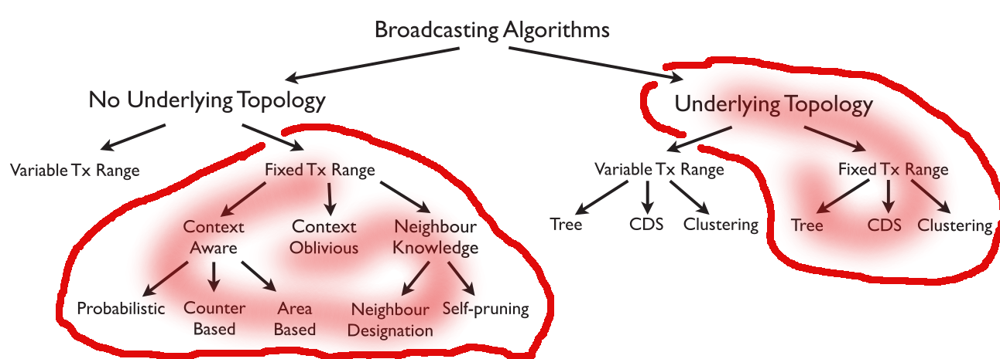

# A brief introduction to a taxonomy of broadcasting protocols
We are using the [taxonomy proposed by Ruiz et al. in 2015](papers/others/survey.pdf). This taxonomy is a useful way to classify broadcasting algorithms based on their features -- how they work, what can the information they use, what kind of physical devices they can use and so on. The taxonomy we follow is described by a tree where in its first level we found, those algorithms who build an **Underlying Topology** (**UT**) and those who do **Not** build an **Underlying Topology** (**NUT**). In the second level of the tree we found those protocols who **Vary** the **Transmission Range** (**VTxR**) and those who keep a **Fixed Transmission Range** (**FTxR**) as it is shown in the next figure:

For the moment, we are interested on algorithms where the antenna transmission range is fixed (the red areas in the picture above). Observe that there are these protocols can be further subclassfied depending on other features (e.g., underlying topology, context-awareness, etc.)

Each algorithm below can be located under one leaf in the taxonomy; we will give the leaf every time we present a method.

# UT algorithms with a FTxR
| Title  | Type | Name | Rank | Year |
| ------------- | ------------- | ------------- | ------------- | ------------- |
| [On Calculating Power-Aware Connected Dominating Sets for Efficient Routing in Ad Hoc Wireless Networks](papers/others/jcn.pdf) | Journal |[JOURNAL OF COMMUNICATIONS AND NETWORKS](http://www.scimagojr.com/journalsearch.php?q=4800154012&tip=sid&clean=0)|  | 2000 |
| [Extended Multipoint Relays to Determine Connected Dominating Sets in MANETs](papers/implemented/cds.pdf)  | Journal | [IEEE Transactions on Computers](http://www.scimagojr.com/journalsearch.php?q=25033&tip=sid&clean=0)|  | 2006 |
|[Dominating sets and neighbor elimination-based broadcasting algorithms in wireless networks](papers/others/DominartingSets02.pdf)| Journal | [IEEE Transactions on Parallel and Distributed Systems](http://www.scimagojr.com/journalsearch.php?q=26098&tip=sid&clean=0) | | 2002 |
| [BODYF – A Parameterless Broadcasting Protocol Over Dynamic Forest](papers/implemented/10.1.1.371.7527.pdf) | Conference | [IEEE International Conference on High Performance Computing and Simulation (HPCS)](http://lipn.univ-paris13.fr/~bennani/CSRank.html)| B | 2008 |
| [Information dissemination in VANETs based upon a tree topology](papers/others/91e59974989554f70cd9cf64d8ac7a1ca9dd.pdf) | Journal | [Journal of Ad Hoc Networks](http://www.scimagojr.com/journalsearch.php?q=26799&tip=sid&clean=0) | | 2012 |

# Implemented
| Title  | Publication Type | Publication Name | Publication Rank | Year | Use Topology |
| ------------- | ------------- | ------------- | ------------- | ------------- | ---- |
|  Multipoint relaying for flooding broadcast messages in mobile wireless networks ([mpr](papers/implemented/mpr.pdf)) | Conference  | Hawaii International Conference on System Sciences  | A  | 2002  | |
| Area-based beaconless reliable broadcasting in sensor networks ([abba](papers/implemented/abba.pdf))  | Journal  | [International Journal of Sensor Networks](http://www.scimagojr.com/journalsearch.php?q=19900192159&tip=sid&clean=0)  |  | 2006  | No |
| Analysis and evaluation of distance-to-mean broadcast method for VANET ( [dist2mean](papers/implemented/dist2mean.pdf), [evaluation](papers/implemented/dist2mean-more.pdf) )  | Journal  | Journal of King Saud University - Computer and Information Sciences/INTERNATIONAL JOURNAL OF COMMUNICATION SYSTEMS  |   | 2013/2015  | No |
| Minimum-Energy Broadcast in All-Wireless Networks: NP-Completeness and Distribution Issues ([ewma](papers/implemented/ewma.pdf))  | Conference  | International Conference on Mobile Computing and Networking  | A*  | 2002 | Yes |

# Unimplemented
The following table presents algorithms that **don't require underlying topology**, with **fixed transmission range**, and (**context-aware** or **context Oblivious**)

| Title  | Publication Type | Publication Name | Publication Rank | Year | Use Topology |
| ------- | --------- | ---------- | --------- | --------- | ---- |
| The broadcast storm problem in a mobile ad hoc network ([simple flooding](papers/others/flooding.pdf))| Conf | MobiCom | A* | 1999 | |
| An adaptive approach to group communications in multi hop ad hoc networks ([Hyper-Flooding](papers/others/hyper-flooding.pdf)) | Conf | International Symposium on Computers and Communications | B | 2002 | |
| The broadcast storm problem in a mobile ad hoc network ([probabilistic flooding](papers/others/flooding.pdf))| Conf | MobiCom | A* | 1999 | |
| Speed adaptive probabilistic flooding in cooperative emergency warning ([SAPF](papers/others/SAPF.pdf)) | Conf | International Conference on Wireless Internet | - | 2008 | |
| Performance improvements for network-wide broadcast with instantaneous network information ([banerjee](papers/others/banerjee.pdf)) | Journal | Network and Computer Applications | A | 2012 | |
| Research and Realization on Improved MANET Distance Broadcast Algorithm Based on Percolation Theory ([Gang](papers/others/gang.pdf)) | Conf | International Conference on Industrial Control and Electronics Engineering | - | 2012 | |
| DibA: An adaptive broadcasting scheme in mobile ad hoc networks ([DibA](papers/others/diba.pdf)) | Conf | Communication Networks and Services Research Conference | | 2009 | |
| Stochastic broadcast for VANET ([slavik-stochastic](slavik-stochastic.pdf)) | Conf | Consumer Communications and Networking Conference | B | 2010 | |
| Location aided broadcast in wireless ad hoc network systems ([SunAndLai](papers/others/SunAndLai.pdf)) | Conf | IEEE Wireless Communications and Networking Conference | B | 2002 | |
| Probabilistic reliable dissemination in large-scale systems ([gossip-based](papers/others/gossip-based.pdf)) | Journal | IEEE Transactions on Parallel Distributed Systems | A* | 2003 | |
| NPPB: A broadcast scheme in dense VANETs ([NPPB](papers/others/NPPB.pdf)) | Journal | Information Technology Journal | | 2010 | |
| Adaptive approaches to relieving broadcast storms in a wireless multihop mobile ad hoc network ([AdaptiveCounter](paper/others/AdaptiveCounter.ps)) | Journal | IEEE Transactions on Computers | A* | 2002 | |
| Color-based broadcasting for ad hoc networks ([color-based](papers/others/color-based.pdf)) | Conf | International Symposium on Modeling and Optimization in Mobile | - | 2006 | |
| A probability-based adaptive scheme for broadcasting in MANETs () | Conf | Conference on Mobile Technology, Application & Systems | | 2009 | |
| Adaptive multihop broadcast protocols for ad hoc networks () | Conf | International Symposium on Communication Systems, Networks Digital Signal Processing | | 2012 | |
| A broadcasting method considering battery lifetime and distance between nodes in MANET ([BMBD](papers/others/)) | Workshop | International Conference on Distributed Computing SystemsWorkshops | A | 2009 | |
| An Efficient Flooding Algorithm for Mobile Ad-hoc Networks ([geoflood.pdf](papers/others/geoflood.pdf)) | Workshop | Workshop on Modeling and Optimizations in Mobile Ad Hoc and Wireless Networks | - | 2004 | |
| Six-shot broadcast: A context-aware algorithm for efficient message diffusion in MANETs ([six-shoot](papers/others/six-shoot.pdf)) | Conf | Confederated International Conferences, CoopIS, DOA, GADA, IS, and ODBASE | | 2008 | |
| Border node retransmission based probabilistic broadcast protocols in ad-hoc networks ([cartigny](papers/others/cartigny.pdf)) | Conf | Hawaii International Conference on System Sciences | A | 2003 | |
| An energy-aware broadcast scheme for directed diffusion in wireless sensor network ([CAO](papers/others/CAO.pdf)) | Journal | Journal of Communication and Computer | C | 2007 | |
